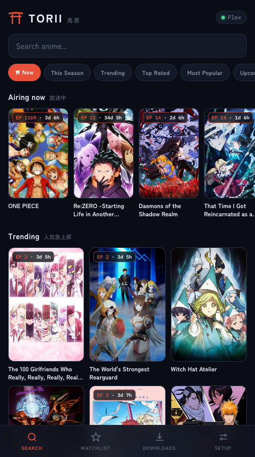

# Torii 鳥居

Anime from [nyaa.si](https://nyaa.si) straight into your Plex library, from any device on your LAN.

Browse the season's charts, tap an episode, and it lands in Plex renamed and organized - or pin a show to your watchlist and new episodes download themselves as fansub groups release them.



## What it does

- Search and browse anime via AniList: posters, airing schedules, synopses, and MAL-style charts (this season, trending, top rated, all-time popular, upcoming, movies, any past season).
- Browse a show episode by episode - every episode with its title and air date (via AniZip), releases fetched on demand per episode with seeder-sorted targeted searches, so even a 15-year-old One Piece episode is one tap away.
- Release rows show subs group, quality, size, seeders, and trusted flags; mixed numbering schemes (seasonal, cour continuation, absolute) resolve to the same episode.
- One tap downloads into your library folder, renamed Plex-style (`Show/Season 01/Show - S01E01 [Group][1080p].mkv`), then triggers a partial Plex scan.
- Watchlist: pin a subs group + quality per show; new episodes auto-download as they appear on nyaa (polls every 30 min, every 10 min around the AniList air time). Adding starts with future releases; use Catch up to queue every currently available matching episode.
- Files are hardlinked into the library so the torrent seeds back with zero extra disk use (ratio/time limits configurable, including "Don't seed").
- Keeps Plex alive (restarts it if it stops), can create the Plex "Anime" library itself, and starts at login.
- Mobile-first PWA: open it on your phone and Add to Home Screen.

## Setup

One command, even on a machine with nothing installed:

```sh
curl -fsSL https://raw.githubusercontent.com/shadohead/torii/main/install.sh | bash
```

That fetches the source to `~/.torii/app`, provisions a private Node.js runtime under `~/.torii/node` if your system has none (no Homebrew, no sudo), installs dependencies, registers the background service (starts at login), builds a double-clickable `Torii.app`, and opens the UI.
It also prints the URL to open on your phone.
On macOS, Torii advertises itself over Bonjour at **http://torii.local**, so the
same memorable address works on the Mac, iPhone, and other devices on the local
network. The numbered LAN URL remains available as a fallback.

From a git checkout instead: `npm run setup` does the same for the checkout (or `bash scripts/setup.sh` if you don't have Node yet).
Prefer minimal? `npm install && npm start` runs it in the foreground with no system integration.
macOS is the primary target; Linux runs fine minus the launchd/app conveniences.
A Plex Media Server on the same machine completes the picture, but Torii runs without one.

Then open **Setup** in the UI and:

1. Point the library folder somewhere your Plex server watches (Torii can also create an "Anime" library in Plex for you).
2. Check the Plex row: on macOS the token is auto-discovered; elsewhere paste your Plex URL and token.

## Uninstall

```sh
curl -fsSL https://raw.githubusercontent.com/shadohead/torii/main/uninstall.sh | bash
```

Or `npm run uninstall` from a checkout.
This stops and removes the background service, deletes `Torii.app`, clears partial downloads (`.incoming`), and removes the program files including the private Node runtime.
Your media library is never touched - everything already organized into Plex stays.
Settings and watchlist survive for a future reinstall; add `--purge` (`... | bash -s -- --purge`) to remove those too.

## Configuration

Everything lives in the Setup tab: library folder (with Plex-coverage detection), Plex URL and token, default quality, download/upload speed limits, peer connections, seed ratio/time, watchlist poll interval, preferred subs groups, start-at-login, keep-Plex-running, and global auto-download.

Environment variables for non-default layouts, read at startup and baked into the service definition when set during `npm run setup`:

| Variable | Default | Purpose |
| --- | --- | --- |
| `TORII_PORT` | `3939` | HTTP port |
| `TORII_DATA_DIR` | `~/.torii` | Database, log, poster cache |
| `TORII_LIBRARY_DIR` | `~/Movies/Anime` | Initial library folder (before first run) |

Service management: `npm run service install | uninstall | status`.
Logs live at `~/.torii/torii.log`.

## Remote access

The web UI has no authentication - it trusts your LAN.
Never port-forward it.
If you want it away from home, put your devices on a [Tailscale](https://tailscale.com) tailnet and open the Mac's tailnet address; that keeps it private without exposing anything.
Remote streaming is Plex's job, not Torii's - enable Plex Remote Access and use the Plex apps.

## Watch together on Discord

Watch anime on your Plex TV while a separate Discord account shares a synchronized
player. Its Chromium login, desktop, audio, episode cache, and FFmpeg encoder run
inside Docker. Your normal Mac Discord account stays logged in separately.

1. Install/start Docker Desktop, restart Torii after updating, then run
   `npm run watch-together:container` from this checkout. The first build downloads
   the Linux desktop dependencies.
2. Play an anime from Torii's library on the TV. In **Setup → Watch together on
   Discord**, refresh players, choose the TV, and enable TV sync.
3. On the server, open [the isolated desktop](http://127.0.0.1:6080/vnc.html?autoconnect=true&resize=scale).
   Sign into the **separate account inside this desktop** and complete any email
   verification. To enable automatic joining/sharing, copy your voice channel's
   Discord URL and run:
   ```sh
   npm run watch-together:container -- automate 'https://discord.com/channels/SERVER_ID/VOICE_CHANNEL_ID' 'Lounge'
   ```
   The destination is saved in the container's own profile volume. When the TV is
   playing, Playwright joins that channel and shares only the **Torii Watch
   Together browser tab** with audio. Chromium's picker is restricted to that
   unique tab title; it cannot select the entire screen or another application.
   Without automation, join/share manually. Sharing the entire desktop does not
   carry tab audio.
   The shared player shows only the video, with no title, buttons, pointer, or
   scrollbars. Automation enters video fullscreen on a 1280×720 virtual display
   after sharing, preserving 16:9 framing across restarts. For manual sharing,
   press **F** or double-click the video for fullscreen; **Esc** exits.
   Click the video if sound needs enabling, or press **M** to toggle mute.
   A clear overlay stays visible while the TV is paused or buffering, or when
   loading/connection/playback problems interrupt the stream. Rewinds,
   fast-forwards/skips, and episode changes show a brief four-second notice.
   These indicators are captured in fullscreen and disappear during normal play.
   The paused view includes the show, episode name, and a read-only progress bar
   with elapsed/total time from the TV.
4. Friends join that Discord channel and click **Watch Stream**. Torii follows TV
   pauses, buffering, seeks, track choices, and episode changes. Automation
   reconnects after an interrupted share and leaves after the TV has been idle for
   60 seconds. It waits for you to handle login, email verification, MFA, or CAPTCHA
   prompts. It uses the logged-in UI, without extracting a Discord token or
   password or using private Discord APIs.

After setup, use **Setup → Watch together on Discord** in `torii.local`:
**Start sharing** resumes automatic sharing in the saved channel and starts the
installed companion if it is stopped. It waits for anime on the selected TV.
**Pause sharing** ends the Discord broadcast and leaves voice within a few seconds;
the TV keeps playing. **Resume sharing** returns to the TV's current position.
The sharing choice survives Torii/container restarts, and pausing takes priority
over automatic reconnection. Docker Desktop must be running; first-time image
installation and Discord login still use the setup steps above.

Browser automation is an unofficial approach. Discord's
[automated account policy](https://support.discord.com/hc/en-us/articles/115002192352-Automated-User-Accounts-Self-Bots)
prohibits automating regular accounts and does not list a personal-server
exception. Enable it only if you accept that account risk. Discord UI changes can
require selector updates; retries back off to five minutes rather than repeatedly
clicking. Configuration is opt-in, and malformed destinations fail closed.

The container's desktop is bound to localhost port 6080. Its only volume holds its
own browser profile; it mounts no Mac directories, display, audio device, or Docker
socket, and runs as an unprivileged user with dropped capabilities. It reaches Torii
over HTTP with a dedicated bearer token, rather than receiving the Plex token. The
media endpoint only serves the selected TV's current single-file anime inside the
configured library, with realpath checks. Torii itself retains its existing trusted
LAN model; the container has network access to reach Torii and Discord.

The first episode load copies the file into the container (up to 8 GB), then encodes
720p H.264/AAC with selected embedded subtitles burned in. Seeking outside the
encoded range rebuilds segments from the TV's new position. Sync is approximate:
Plex reports position periodically, and Discord adds latency. Use the adjustment
in Setup to tune it (positive means the companion is ahead). When Plex fails or
progress stops arriving for 30 seconds, the companion pauses. External subtitles
and multipart episodes are currently unsupported. Check audio and subtitle tracks
on an actual episode before inviting friends; the Setup status confirms container
playback and observed Discord capture state. "Discord sharing video + audio"
means the browser has live audio/video capture tracks and Discord shows its stop
streaming control, not that a remote viewer has confirmed reception.

Keep Docker/the server awake for a sharing session. The isolated Discord login
persists across restarts, as does the configured automation destination. With
automation enabled, restarting the container rejoins/reshares when the TV is active.
Manage it with `npm run watch-together:container -- stop | status | logs`.
Inspect automation with `npm run watch-together:container -- automation-status`;
disable automatic actions with `npm run watch-together:container -- automation-off`
(an already-running share is left alone). Re-enable it with `automate CHANNEL_URL`.
To use a different Torii port, set `TORII_PORT` when starting the container; for
custom networking, set `TORII_LOCAL_URL` (launcher connection) and
`TORII_COMPANION_URL` (container connection). No host Plex playback is modified.

## Design notes

- Node 22-era ESM, zero-framework HTTP server, two dependencies: `webtorrent` (pinned to v2 - v3 has a piece-accounting regression) and `better-sqlite3`.
- Data sources: AniList (search, charts, schedules), AniZip (episode titles and numbering maps), nyaa.si RSS (releases); all responses cached in sqlite.
- `scripts/patch-webtorrent.mjs` (postinstall) null-guards a piece/bitfield race in webtorrent.
- Idle footprint ~0% CPU / ~75 MB RSS; the torrent client is created lazily and destroyed when no torrents are active. DHT off (nyaa is tracker-based), upload capped at 512 KB/s by default.
- On macOS the service runs under launchd with `Nice 10` + `LowPriorityBackgroundIO`, so downloads never fight your foreground work.

## Known limits

- Long-running shows with absolute numbering (One Piece, Re:Zero on SubsPlease) get filed as `S0xE<absolute>`; Plex metadata matching for those episodes can be off even though playback is fine.
- Torrent and usenet indexers other than nyaa.si are out of scope; this is an anime-first tool.

## License

MIT
